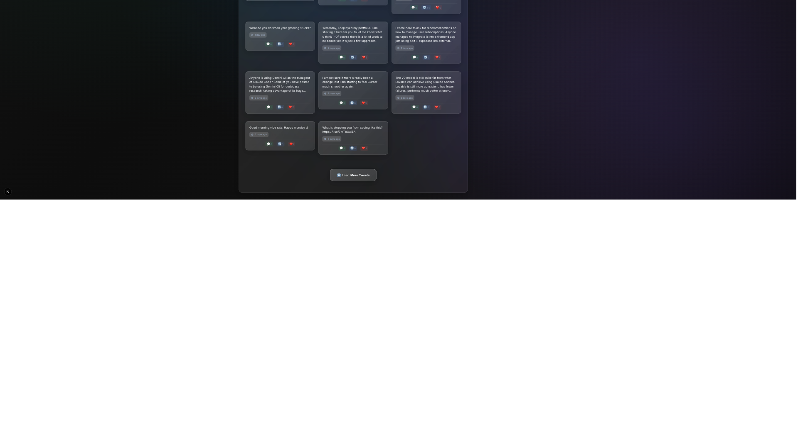

# X Personal Assistant

A modern Twitter assistant application that analyzes and enhances your Twitter interactions using AI.

## 🚀 Features

- Extract and analyze tweets from Twitter profiles
- AI-powered writing style analysis using Google Gemini API
- Modern dark mode interface with glass morphism design
- Real-time Twitter data analysis
- AI-driven content insights and recommendations

## 📸 Screenshots

### Main Application Interface

*Complete application view showing Twitter profile, tweets feed, and AI chat integration*

### AI Writing Style Analysis

*Detailed AI-powered analysis of writing style, sentiment, and engagement patterns*

### AI Chat Assistant

*Interactive chat with Gemini AI providing personalized Twitter engagement recommendations*

## ✨ Key Features Demonstrated

### 🔍 Real-time Tweet Analysis
- **Live Twitter Feed**: Automatically fetches and displays recent tweets
- **User Profile Integration**: Shows profile picture, follower count, and verification status
- **Tweet Engagement Metrics**: Real-time likes, retweets, and reply counts

### 🧠 AI-Powered Style Analysis
- **Writing Style Score**: Comprehensive 0-100 scoring system
- **Detailed Breakdowns**: Analysis of tone, sentiment, engagement level
- **Topic Identification**: Automatically identifies common themes and topics
- **Language Patterns**: Recognizes writing patterns and technical vocabulary usage
- **Actionable Recommendations**: Specific suggestions for improvement

### 💬 Intelligent Chat Assistant
- **Context-Aware Responses**: AI understands your Twitter profile and writing style
- **Personalized Advice**: Tailored recommendations based on your specific needs
- **Real-time Interaction**: Powered by Google Gemini 2.0 Flash for fast responses
- **Professional Guidance**: Expert-level advice on Twitter engagement strategies

### 🎨 Modern User Interface
- **Dark Mode Design**: Easy on the eyes with professional glass morphism effects
- **Responsive Layout**: Works perfectly on desktop and mobile devices
- **Real-time Updates**: Live status indicators for API connections
- **Intuitive Navigation**: Clean, organized interface with clear visual hierarchy

## 🔄 How It Works

1. **🔧 Setup**: Configure your Twitter and Gemini API keys in the settings
2. **📡 Connect**: The app automatically connects to both APIs and verifies credentials
3. **🔍 Analyze**: Enter any Twitter username to fetch and analyze their tweets
4. **🧠 AI Analysis**: Click "Analizar" to get a comprehensive AI-powered writing style analysis
5. **💬 Chat**: Ask questions to the AI assistant for personalized advice and recommendations
6. **📈 Improve**: Use the insights and recommendations to enhance your Twitter strategy

### User Flow Example:
1. Open the application → APIs connect automatically
2. User profile loads (or enter different username)
3. Recent tweets display with engagement metrics
4. Run style analysis → Get detailed 65/100 score with breakdown
5. Chat with AI → "¿Cómo puedo mejorar mi engagement en Twitter?"
6. Receive personalized recommendations based on your analysis

## ��️ Technology Stack

- **Frontend**: Next.js 14 with TypeScript
- **Styling**: Tailwind CSS with Dark Mode
- **APIs**: 
  - RapidAPI Twitter API for tweet extraction
  - Google Gemini API for AI analysis

## 📋 Prerequisites

- Node.js 18+ and npm
- RapidAPI account with Twitter API access
- Google AI Studio account for Gemini API

## ⚙️ Installation & Setup

1. **Clone the repository**
   ```bash
   git clone <repository-url>
   cd X-personal-assistant
   ```

2. **Install dependencies**
   ```bash
   npm install
   ```

3. **Configure environment variables**
   
   Copy the example environment file:
   ```bash
   cp env.example .env
   ```
   
   Edit `.env` and add your API credentials:
   ```env
   # Twitter API Configuration (RapidAPI)
   TWITTER_RAPIDAPI_KEY=your_rapidapi_key_here
   TWITTER_RAPIDAPI_HOST=twitter-v24.p.rapidapi.com
   
   # Google Gemini AI Configuration  
   GEMINI_API_KEY=your_gemini_api_key_here
   
   # Application URL (replace with your domain in production)
   NEXT_PUBLIC_APP_URL=https://yourdomain.com
   
   # Security Configuration (REQUIRED for production)
   CONFIG_SECRET=your_secure_random_string_here_min_32_chars
   
   # Optional: Default Twitter Username
   NEXT_PUBLIC_DEFAULT_USERNAME=your_twitter_username
   ```

   **⚠️ Security Note**: For production deployment, generate a secure CONFIG_SECRET:
   ```bash
   openssl rand -hex 32
   ```

4. **Start the development server**
   ```bash
   npm run dev
   ```

5. **Open your browser**
   Navigate to `http://localhost:3000`

## 🔑 API Configuration

### Twitter API (RapidAPI)
1. Sign up at [RapidAPI](https://rapidapi.com)
2. Subscribe to a Twitter API service
3. Get your API key from the dashboard
4. Add it to your `.env` file

### Google Gemini API
1. Visit [Google AI Studio](https://makersuite.google.com/app/apikey)
2. Create a new API key
3. Add it to your `.env` file

## 🚀 Production Deployment

### Pre-Deployment Security Checklist
1. **Generate secure CONFIG_SECRET**:
   ```bash
   openssl rand -hex 32
   ```

2. **Verify environment variables**:
   ```bash
   npm run build:secure
   ```

3. **Set production environment variables**:
   ```env
   NODE_ENV=production
   TWITTER_RAPIDAPI_KEY=your_production_key
   GEMINI_API_KEY=your_production_key
   NEXT_PUBLIC_APP_URL=https://yourdomain.com
   CONFIG_SECRET=your_generated_secure_secret
   NEXT_PUBLIC_DEFAULT_USERNAME=default_username
   ```

### Build the application
```bash
npm run build
npm start
```

### Environment Variables for Production
**REQUIRED** variables for production deployment:

| Variable | Description | Example |
|----------|-------------|---------|
| `TWITTER_RAPIDAPI_KEY` | RapidAPI Twitter API key | `abc123...` |
| `GEMINI_API_KEY` | Google Gemini API key | `xyz789...` |
| `CONFIG_SECRET` | Secure random string (32+ chars) | Generated with `openssl rand -hex 32` |
| `NEXT_PUBLIC_APP_URL` | Your production domain | `https://yourdomain.com` |
| `NODE_ENV` | Environment mode | `production` |

**OPTIONAL** variables:
| Variable | Description | Default |
|----------|-------------|---------|
| `NEXT_PUBLIC_DEFAULT_USERNAME` | Default Twitter username | `username` |
| `RATE_LIMIT_MAX` | API rate limit | `100` |
| `RATE_LIMIT_WINDOW` | Rate limit window (ms) | `900000` |

### Deployment Platforms
This application can be deployed to:
- **Vercel** (recommended for Next.js)
  ```bash
  vercel --prod
  ```
- **Netlify**
- **AWS Amplify**
- **Docker** (use provided Dockerfile)
- Any platform supporting Node.js 18+

### Production Security Features
✅ **Automatic security headers** (CSP, HSTS, X-Frame-Options)  
✅ **Rate limiting** on API endpoints  
✅ **Input validation** and sanitization  
✅ **API key masking** in logs  
✅ **Environment-based configuration**

## 🔒 Security

- All API keys must be stored in environment variables
- Never commit your `.env` file to version control
- Use the provided `env.example` as a template
- All sensitive data is handled server-side

## 📖 Usage

1. Configure your API keys in the environment variables
2. Start the application
3. Enter a Twitter username to analyze
4. View AI-powered insights and analysis

## ⚠️ Important Security Notes

- **Never** expose API keys in client-side code
- Always use environment variables for sensitive configuration
- The `.env` file is included in `.gitignore` for security
- Review all code before deployment to ensure no hardcoded credentials

## 🤝 Contributing

1. Fork the repository
2. Create a feature branch
3. Make your changes
4. Test thoroughly
5. Submit a pull request

## 📄 License

This project is open source and available under the MIT License. 