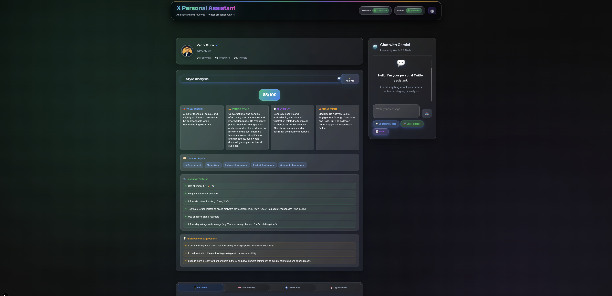
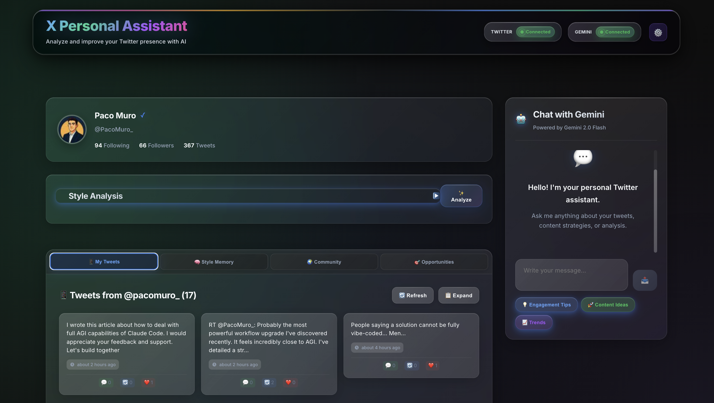
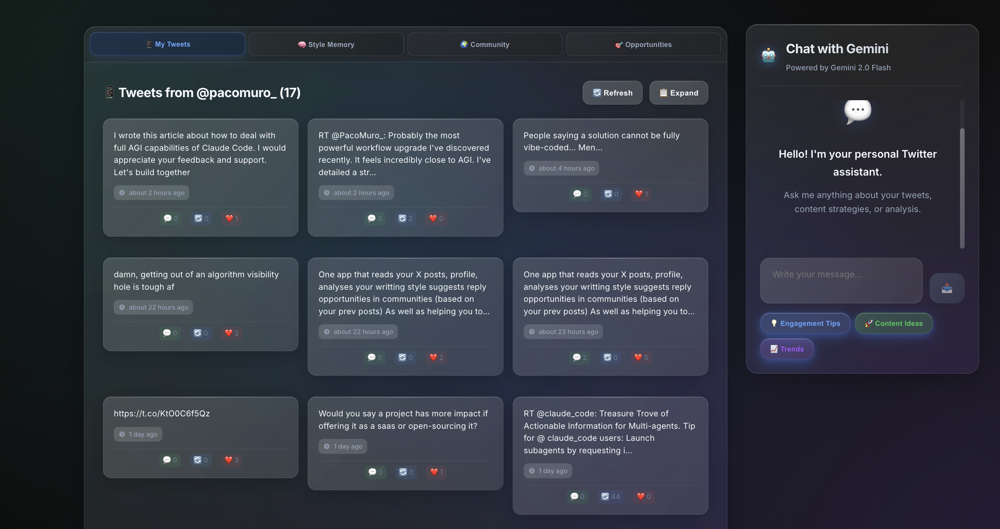

# xPersonalAsistant 🤖

[](https://opensource.org/licenses/Apache-2.0)
[](https://nextjs.org/)
[](https://reactjs.org/)
[](https://www.typescriptlang.org/)
[](https://tailwindcss.com/)
[](http://makeapullrequest.com)

> **An intelligent AI-powered Twitter/X assistant that analyzes your social media presence and provides personalized optimization recommendations using Google Gemini AI.**

## 📑 Table of Contents

- [Overview](#-overview)
- [Key Features](#-key-features)
- [Screenshots](#-screenshots)
- [How It Works](#-how-it-works)
- [Technology Stack](#️-technology-stack)
- [Prerequisites](#-prerequisites)
- [Installation & Setup](#️-installation--setup)
- [Environment Variables](#-environment-variables)
- [API Configuration](#-api-configuration)
- [Production Deployment](#-production-deployment)
- [Usage Guide](#-usage-guide)
- [Security Best Practices](#-security-best-practices)
- [Troubleshooting](#-troubleshooting)
- [Contributing](#-contributing)
- [License](#-license)
- [Support](#-support)

## 🌟 Overview

**xPersonalAsistant** is a cutting-edge web application that revolutionizes how you interact with Twitter/X. By combining real-time Twitter data analysis with Google's powerful Gemini AI, it provides deep insights into your writing style, engagement patterns, and content strategy to help you build a stronger social media presence.

### 🎯 What Makes It Special?

- **AI-Powered Analysis**: Leverages Google Gemini 2.0 Flash for intelligent content analysis
- **Real-Time Data**: Instant access to Twitter profiles, tweets, and engagement metrics
- **Personalized Insights**: Tailored recommendations based on your unique writing style
- **Modern Interface**: Beautiful dark mode UI with glass morphism design
- **Professional Grade**: Built with enterprise-level security and performance standards

## ✨ Key Features

### 🔍 **Comprehensive Twitter Analysis**
- **Profile Intelligence**: Deep analysis of Twitter profiles with follower metrics and verification status
- **Tweet Extraction**: Real-time fetching of recent tweets with engagement data
- **Performance Metrics**: Track likes, retweets, replies, and overall engagement rates
- **Historical Insights**: Analyze patterns across multiple tweets and time periods

### 🧠 **AI-Powered Writing Style Analysis**
- **Smart Scoring System**: Comprehensive 0-100 writing effectiveness score
- **Detailed Breakdowns**: Analysis of tone, sentiment, engagement potential, and authenticity
- **Topic Identification**: Automatic detection of content themes and subject matter expertise
- **Language Pattern Recognition**: Identifies writing patterns, vocabulary usage, and communication style
- **Actionable Recommendations**: Specific, data-driven suggestions for content improvement

### 💬 **Intelligent Chat Assistant**
- **Context-Aware AI**: Understands your Twitter profile and personal writing style
- **Personalized Guidance**: Tailored advice based on your specific goals and audience
- **Real-Time Interaction**: Instant responses powered by Google Gemini 2.0 Flash
- **Strategic Insights**: Expert-level recommendations for Twitter growth and engagement
- **Multi-Language Support**: Professional English communication with global accessibility

### 🎨 **Modern User Experience**
- **Dark Mode Design**: Eye-friendly interface with professional glass morphism effects
- **Responsive Layout**: Seamless experience across desktop, tablet, and mobile devices
- **Real-Time Status**: Live indicators for API connections and system health
- **Intuitive Navigation**: Clean, organized interface with logical information hierarchy
- **Accessibility**: WCAG-compliant design ensuring usability for all users

## 📸 Screenshots

### Application Overview - Main Interface

*Clean application interface showing the main dashboard with Twitter integration and AI chat sidebar*

### Application Overview - Full Interface  

*Complete application view displaying all main features and navigation elements*

### Tweets Analysis & AI Chat

*Real-time Twitter feed with collected tweets, timestamps, and active AI chat conversation*

## 🔄 How It Works

### **Step-by-Step User Journey**

1. **🔧 Initial Setup**: Configure Twitter and Gemini AI API credentials through secure environment variables
2. **📡 Automatic Connection**: The application establishes secure connections to both APIs with real-time status verification
3. **🔍 Profile Analysis**: Enter any Twitter username to fetch comprehensive profile data and recent tweets
4. **🧠 AI Processing**: Click "Analyze" to trigger deep AI-powered analysis of writing style and content patterns
5. **💬 Interactive Consultation**: Engage with the AI assistant for personalized advice and strategic recommendations
6. **📈 Implementation**: Apply insights and recommendations to enhance your Twitter presence and engagement

### **Real-World Example Workflow**
```
1. Application Launch → APIs automatically connect and verify credentials
2. User Profile Load → Display @username with follower count and verification status
3. Tweet Extraction → Show 20 most recent tweets with engagement metrics
4. AI Analysis Trigger → Generate comprehensive 65/100 writing style score
5. Detailed Insights → Breakdown of tone, sentiment, topics, and improvement areas
6. AI Consultation → Ask: "How can I improve my Twitter engagement?"
7. Personalized Response → Receive specific, actionable recommendations
```

## 🛠️ Technology Stack

### **Frontend Technologies**
- **[Next.js 15.3.4](https://nextjs.org/)** - React framework with App Router and server-side rendering
- **[React 19.1.0](https://reactjs.org/)** - Modern component-based UI library
- **[TypeScript 5.8.3](https://www.typescriptlang.org/)** - Type-safe development with enhanced IDE support
- **[Tailwind CSS 4.1.11](https://tailwindcss.com/)** - Utility-first CSS framework with dark mode support

### **AI & API Integration**
- **[Google Gemini API](https://ai.google.dev/)** - Advanced AI for content analysis and recommendations
- **[RapidAPI Twitter API](https://rapidapi.com/)** - Reliable Twitter data extraction and profile analysis

### **Development & Security**
- **ESLint & TypeScript** - Code quality and type safety enforcement
- **Security Headers** - CSP, HSTS, and X-Frame-Options for production security
- **Rate Limiting** - Built-in API protection and abuse prevention
- **Environment-based Configuration** - Secure credential management

## 📋 Prerequisites

### **System Requirements**
- **Node.js 18.0+** (Latest LTS recommended)
- **npm 8.0+** or **yarn 1.22+**
- **Git** for version control

### **API Accounts Required**
1. **[RapidAPI Account](https://rapidapi.com/)** with Twitter API subscription
2. **[Google AI Studio Account](https://makersuite.google.com/)** for Gemini API access
3. **Production Domain** (for deployment)

### **Recommended Development Tools**
- **Visual Studio Code** with TypeScript and Tailwind CSS extensions
- **Modern Web Browser** with developer tools
- **Terminal/Command Line** access

## ⚙️ Installation & Setup

### **1. Clone the Repository**
```bash
git clone https://github.com/yourusername/xPersonalAsistant.git
cd xPersonalAsistant
```

### **2. Install Dependencies**
```bash
npm install
# or
yarn install
```

### **3. Environment Configuration**

Copy the example environment file and configure your credentials:
```bash
cp env.example .env.local
```

### **4. Configure Environment Variables**
Edit `.env.local` with your API credentials:

```env
# Twitter API Configuration (RapidAPI)
TWITTER_RAPIDAPI_KEY=your_rapidapi_key_here
TWITTER_RAPIDAPI_HOST=twitter-v24.p.rapidapi.com

# Google Gemini AI Configuration
GEMINI_API_KEY=your_gemini_api_key_here

# Application Configuration
NEXT_PUBLIC_APP_URL=http://localhost:3000
NEXT_PUBLIC_APP_NAME=xPersonalAsistant
NEXT_PUBLIC_DEFAULT_USERNAME=your_twitter_username

# Security Configuration
CONFIG_SECRET=your_secure_random_string_here_min_32_chars

# Environment
NODE_ENV=development
```

### **5. Generate Security Secret**
For production deployment, generate a secure configuration secret:
```bash
# Generate secure random string
openssl rand -hex 32

# Add to your .env.local file
CONFIG_SECRET=generated_secure_string_here
```

### **6. Start Development Server**
```bash
npm run dev
# or
yarn dev
```

### **7. Access Application**
Open your browser and navigate to:
```
http://localhost:3000
```

## 🌍 Environment Variables

### **Required Variables**

| Variable | Description | Example | Notes |
|----------|-------------|---------|-------|
| `TWITTER_RAPIDAPI_KEY` | RapidAPI Twitter API key | `abc123def456...` | Get from [RapidAPI Dashboard](https://rapidapi.com/) |
| `GEMINI_API_KEY` | Google Gemini API key | `xyz789uvw012...` | Get from [Google AI Studio](https://makersuite.google.com/) |
| `CONFIG_SECRET` | Security configuration secret | `32+ character string` | Generate with `openssl rand -hex 32` |

### **Optional Configuration**

| Variable | Description | Default | Production |
|----------|-------------|---------|------------|
| `NEXT_PUBLIC_APP_URL` | Application domain | `http://localhost:3000` | `https://yourdomain.com` |
| `NEXT_PUBLIC_DEFAULT_USERNAME` | Default Twitter username | `username` | Your handle |
| `RATE_LIMIT_MAX` | API rate limit per window | `100` | Adjust based on needs |
| `RATE_LIMIT_WINDOW` | Rate limit time window (ms) | `900000` | 15 minutes default |
| `LOG_LEVEL` | Application logging level | `info` | `warn` for production |

### **Security & Performance**

| Variable | Description | Development | Production |
|----------|-------------|-------------|------------|
| `NODE_ENV` | Environment mode | `development` | `production` |
| `NEXT_TELEMETRY_DISABLED` | Disable Next.js telemetry | `0` | `1` |
| `FORCE_HTTPS` | Enforce HTTPS connections | `false` | `true` |
| `PERFORMANCE_MONITORING` | Enable performance tracking | `false` | `true` |

## 🔑 API Configuration

### **Twitter API Setup (RapidAPI)**

1. **Create RapidAPI Account**
   - Visit [RapidAPI](https://rapidapi.com/) and sign up
   - Navigate to the API marketplace

2. **Subscribe to Twitter API**
   - Search for "Twitter API v2.4" or similar service
   - Choose a subscription plan based on your usage needs
   - Note: Free tier typically includes 100-500 requests/month

3. **Get API Credentials**
   - Access your RapidAPI dashboard
   - Copy your API key from the credentials section
   - Add to `TWITTER_RAPIDAPI_KEY` in your environment file

### **Google Gemini AI Setup**

1. **Access Google AI Studio**
   - Visit [Google AI Studio](https://makersuite.google.com/app/apikey)
   - Sign in with your Google account

2. **Create API Key**
   - Click "Create API Key"
   - Select your Google Cloud project or create a new one
   - Copy the generated API key

3. **Configure Gemini Settings**
   - Add API key to `GEMINI_API_KEY` in your environment file
   - Verify API quota and usage limits in Google Cloud Console

### **API Testing & Verification**

Test your API connections:
```bash
# Run the built-in API test
npm run test:apis

# Or manually test endpoints
curl -X GET "http://localhost:3000/api/config" \
  -H "Content-Type: application/json"
```

## 🚀 Production Deployment

### **Pre-Deployment Checklist**

- [ ] Generate secure `CONFIG_SECRET` using `openssl rand -hex 32`
- [ ] Set `NODE_ENV=production` in environment variables
- [ ] Configure production domain in `NEXT_PUBLIC_APP_URL`
- [ ] Verify all API keys are valid and have sufficient quotas
- [ ] Run security audit: `npm run security-check`
- [ ] Test build process: `npm run build:secure`

### **Build & Deploy**

```bash
# Security-enhanced build process
npm run build:secure

# Start production server
npm start

# Or deploy to platform of choice
npm run deploy
```

### **Deployment Platforms**

#### **Vercel (Recommended)**
```bash
# Install Vercel CLI
npm i -g vercel

# Deploy with environment variables
vercel --prod
```

#### **Docker Deployment**
```dockerfile
# Use the provided Dockerfile
docker build -t xpersonal-assistant .
docker run -p 3000:3000 --env-file .env.production xpersonal-assistant
```

#### **Other Platforms**
- **Netlify**: Direct Git integration
- **AWS Amplify**: Full-stack hosting
- **Railway**: Simple deployment
- **DigitalOcean App Platform**: Container-based hosting

### **Production Environment Variables**

```env
# Production Configuration
NODE_ENV=production
NEXT_PUBLIC_APP_URL=https://yourdomain.com
CONFIG_SECRET=your_generated_secure_secret_here

# API Credentials (same as development)
TWITTER_RAPIDAPI_KEY=your_production_key
GEMINI_API_KEY=your_production_key

# Security & Performance
FORCE_HTTPS=true
NEXT_TELEMETRY_DISABLED=1
PERFORMANCE_MONITORING=true
LOG_LEVEL=warn
```

## 📚 Usage Guide

### **Getting Started**

1. **Initial Configuration**
   - Ensure all environment variables are properly configured
   - Verify API connections show green status indicators
   - Test with your own Twitter username first

2. **Analyzing Twitter Profiles**
   ```
   Step 1: Enter username in the profile input field
   Step 2: Wait for profile and tweets to load
   Step 3: Review displayed engagement metrics
   Step 4: Click "Analyze Writing Style" button
   Step 5: Review comprehensive AI analysis results
   ```

3. **Using the AI Assistant**
   ```
   Example Questions:
   - "How can I improve my Twitter engagement?"
   - "What topics should I focus on for my audience?"
   - "How can I make my tweets more professional?"
   - "What's the best posting schedule for my content?"
   ```

### **Advanced Features**

- **Bulk Analysis**: Analyze multiple profiles by entering different usernames
- **Historical Comparison**: Compare analysis results over time
- **Export Results**: Save analysis reports for future reference
- **Custom Prompts**: Ask specific questions about your content strategy

## 🔒 Security Best Practices

### **Environment Security**
- ✅ Never commit `.env` files to version control
- ✅ Use strong, unique `CONFIG_SECRET` (32+ characters)
- ✅ Rotate API keys regularly (quarterly recommended)
- ✅ Use environment-specific configurations for dev/staging/production

### **API Security**
- ✅ Implement rate limiting on all API endpoints
- ✅ Validate and sanitize all user inputs
- ✅ Use HTTPS in production environments
- ✅ Monitor API usage and set up alerts for unusual activity

### **Application Security**
- ✅ Enable security headers (CSP, HSTS, X-Frame-Options)
- ✅ Regular dependency updates and security audits
- ✅ Input validation and XSS protection
- ✅ Secure session management and data handling

### **Production Hardening**
```bash
# Run security audit
npm audit

# Check for vulnerabilities
npm run security-check

# Update dependencies
npm update

# Generate new CONFIG_SECRET periodically
openssl rand -hex 32
```

## 🛠️ Troubleshooting

### **Common Issues & Solutions**

#### **API Connection Problems**
```
Problem: "API connection failed" error
Solutions:
1. Verify API keys are correctly set in environment variables
2. Check API quota limits in respective dashboards
3. Ensure internet connectivity and firewall settings
4. Test API endpoints directly with curl/Postman
```

#### **Build & Deployment Issues**
```
Problem: Build fails with TypeScript errors
Solutions:
1. Run `npm run type-check` to identify type issues
2. Update dependencies: `npm update`
3. Clear Next.js cache: `rm -rf .next`
4. Verify Node.js version compatibility (18+)
```

#### **Environment Variable Issues**
```
Problem: Environment variables not loading
Solutions:
1. Ensure file is named `.env.local` for development
2. Check file is in project root directory
3. Restart development server after changes
4. Verify no spaces around = in variable definitions
```

#### **Performance Issues**
```
Problem: Slow API responses or timeouts
Solutions:
1. Check API rate limits and usage
2. Optimize network connectivity
3. Consider implementing caching strategies
4. Monitor server resources and scaling needs
```

### **Debug Mode**
Enable detailed logging for troubleshooting:
```bash
# Set debug environment variables
LOG_LEVEL=debug
NEXT_DEBUG_BUILD=true

# Run with verbose output
npm run dev -- --debug
```

### **Getting Help**
- 📖 Check this documentation first
- 🐛 Search existing [GitHub Issues](https://github.com/yourusername/xPersonalAsistant/issues)
- 💬 Join our [Discord Community](https://discord.gg/yourserver)
- 📧 Contact support: support@yourdomain.com

## 🤝 Contributing

We welcome contributions from the community! Here's how you can help improve xPersonalAsistant:

### **Getting Started**

1. **Fork the Repository**
   ```bash
   git clone https://github.com/yourusername/xPersonalAsistant.git
   cd xPersonalAsistant
   ```

2. **Create Feature Branch**
   ```bash
   git checkout -b feature/your-feature-name
   ```

3. **Set Up Development Environment**
   ```bash
   npm install
   cp env.example .env.local
   # Configure your API keys
   npm run dev
   ```

### **Contribution Guidelines**

#### **Code Standards**
- ✅ Follow TypeScript best practices and strict type checking
- ✅ Use ESLint and Prettier for code formatting
- ✅ Write meaningful commit messages following conventional commits
- ✅ Include comprehensive JSDoc comments for functions
- ✅ Maintain consistent naming conventions

#### **Pull Request Process**
1. **Before Starting**: Check existing issues and PRs to avoid duplicates
2. **Development**: Write clean, tested code with proper documentation
3. **Testing**: Verify all functionality works as expected
4. **Documentation**: Update README and inline documentation as needed
5. **Submit PR**: Provide clear description of changes and testing performed

#### **Types of Contributions Welcome**
- 🐛 **Bug Fixes**: Identify and resolve issues
- ✨ **New Features**: Enhance functionality and user experience
- 📖 **Documentation**: Improve guides, examples, and API documentation
- 🎨 **UI/UX**: Design improvements and accessibility enhancements
- 🔧 **DevOps**: Build processes, deployment, and infrastructure
- 🧪 **Testing**: Unit tests, integration tests, and QA improvements

### **Development Scripts**

```bash
# Development
npm run dev              # Start development server
npm run build           # Build for production
npm run start           # Start production server

# Quality Assurance
npm run lint            # Run ESLint
npm run type-check      # TypeScript type checking
npm run security-check  # Security audit
npm run build:secure    # Full security-enhanced build

# Testing & Analysis
npm run test            # Run test suite
npm run build:analyze   # Bundle analysis
```

### **Code of Conduct**

We are committed to providing a welcoming and inclusive environment for all contributors. Please read and follow our [Code of Conduct](CODE_OF_CONDUCT.md).

## 📄 License

This project is licensed under the **Apache License 2.0** - see the [LICENSE](LICENSE) file for complete details.

### **Key License Points**
- ✅ **Commercial Use**: Free to use in commercial projects
- ✅ **Modification**: Modify and distribute modified versions
- ✅ **Distribution**: Distribute original or modified versions
- ✅ **Patent Grant**: Includes express patent license from contributors
- ⚠️ **Attribution**: Must include copyright notice and license
- ⚠️ **State Changes**: Must document modifications to original files

### **Copyright Notice**
```
Copyright 2024 X Personal Assistant

Licensed under the Apache License, Version 2.0 (the "License");
you may not use this file except in compliance with the License.
You may obtain a copy of the License at

    http://www.apache.org/licenses/LICENSE-2.0

Unless required by applicable law or agreed to in writing, software
distributed under the License is distributed on an "AS IS" BASIS,
WITHOUT WARRANTIES OR CONDITIONS OF ANY KIND, either express or implied.
See the License for the specific language governing permissions and
limitations under the License.
```

## 💬 Support

### **Community & Support Channels**

- 📖 **Documentation**: [Complete Guide](https://docs.yourdomain.com)
- 🐛 **Bug Reports**: [GitHub Issues](https://github.com/yourusername/xPersonalAsistant/issues)
- 💡 **Feature Requests**: [GitHub Discussions](https://github.com/yourusername/xPersonalAsistant/discussions)
- 💬 **Community Chat**: [Discord Server](https://discord.gg/yourserver)
- 📧 **Direct Support**: support@yourdomain.com

### **Professional Support**

For enterprise implementations, custom integrations, or priority support:
- 🏢 **Enterprise Consulting**: enterprise@yourdomain.com
- 🔧 **Custom Development**: development@yourdomain.com
- 📊 **Analytics & Reporting**: analytics@yourdomain.com

---

<div align="center">

**Built with ❤️ by the xPersonalAsistant Team**

[Website](https://yourdomain.com) • [Documentation](https://docs.yourdomain.com) • [Community](https://discord.gg/yourserver) • [Twitter](https://twitter.com/yourhandle)

⭐ **If this project helps you, please consider giving it a star!** ⭐

</div> 